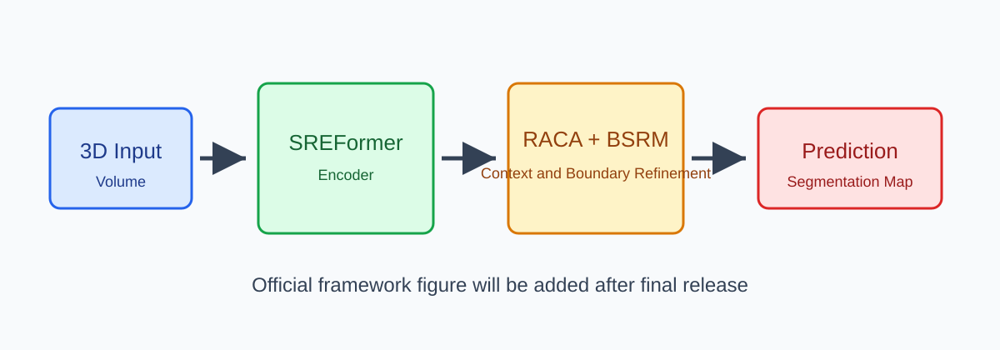

# SREFormer

[](#citation)
[](LICENSE)

Official PyTorch implementation of **SREFormer** for lightweight 3D medical image segmentation.

> This repository is being prepared as the official reproducibility package for the manuscript currently under review at *Computerized Medical Imaging and Graphics*. Source files are currently populated with structured placeholders and will be replaced with the finalized implementation.

## Overview

SREFormer is designed for efficient 3D medical image segmentation with selective representation enhancement. The framework includes:

- **RACA**: Register-Augmented Context Attention for compact global context aggregation.
- **BSRM**: Boundary-Structure Refinement Module for decoding-stage semantic refinement.
- A lightweight 3D segmentation backbone for volumetric medical imaging.

<p align="center">
  
</p>

## News

- 2026-10-07: Repository skeleton released with reproducibility-oriented placeholders.

## Repository Structure

```text
SREFormer/
├── configs/              # Dataset and experiment configuration files
├── datasets/             # Dataset loaders and preparation instructions
├── models/               # SREFormer, RACA, and BSRM modules
├── losses/               # Segmentation loss functions
├── utils/                # Metrics, checkpointing, and reproducibility helpers
├── tools/                # Preprocessing and profiling utilities
├── scripts/              # Example training/evaluation shell scripts
├── figures/              # README and paper figure placeholders
├── checkpoints/          # Checkpoint release notes; large weights are not tracked
├── results/              # Reported result tables and logs
├── train.py              # Training entry point
└── test.py               # Evaluation entry point
```

## Installation

### Requirements

The finalized environment will be released with the accepted implementation. The current placeholder environment targets:

- Python 3.10+
- PyTorch 2.0+
- CUDA-capable GPU for 3D training

```bash
git clone https://github.com/ShuoMaLab/SREFormer.git
cd SREFormer

conda env create -f environment.yml
conda activate sreformer
```

Alternatively:

```bash
pip install -r requirements.txt
```

## Dataset Preparation

The experiments are organized around three public 3D medical segmentation datasets:

| Dataset | Task | Status |
| --- | --- | --- |
| BraTS2017 | Brain tumor segmentation | Placeholder instructions |
| ACDC | Cardiac MRI segmentation | Placeholder instructions |
| Synapse | Multi-organ abdominal CT segmentation | Placeholder instructions |

Expected directory layout:

```text
data/
├── BraTS2017/
│   ├── images/
│   ├── labels/
│   └── splits/
├── ACDC/
│   ├── images/
│   ├── labels/
│   └── splits/
└── Synapse/
    ├── images/
    ├── labels/
    └── splits/
```

Detailed preprocessing instructions will be provided in [datasets/README.md](datasets/README.md).

## Usage

### Training

```bash
# Train on Synapse
python train.py --config configs/synapse.yaml

# Train on ACDC
python train.py --config configs/acdc.yaml

# Train on BraTS2017
python train.py --config configs/brats2017.yaml
```

### Evaluation

```bash
python test.py --config configs/synapse.yaml --checkpoint checkpoints/synapse_best.pth
python test.py --config configs/acdc.yaml --checkpoint checkpoints/acdc_best.pth
python test.py --config configs/brats2017.yaml --checkpoint checkpoints/brats2017_best.pth
```

### Model Profiling

```bash
python tools/profile_model.py --config configs/synapse.yaml
```

## Pretrained Weights

Pretrained checkpoints are not tracked by Git. Release links will be added here when available.

| Dataset | Checkpoint | Status |
| --- | --- | --- |
| BraTS2017 | `brats2017_best.pth` | To be released |
| ACDC | `acdc_best.pth` | To be released |
| Synapse | `synapse_best.pth` | To be released |

See [checkpoints/README.md](checkpoints/README.md) for the expected checkpoint layout.

## Results

The final quantitative results will be added after the reproducibility package is finalized.

| Dataset | Dice | HD95 | Params | GFLOPs |
| --- | ---: | ---: | ---: | ---: |
| BraTS2017 | TBD | TBD | TBD | TBD |
| ACDC | TBD | TBD | TBD | TBD |
| Synapse | TBD | TBD | TBD | TBD |

## Citation

If you find this repository useful, please cite our paper after publication:

```bibtex
@article{sreformer2026,
  title   = {SREFormer: Placeholder Title for Lightweight 3D Medical Image Segmentation},
  author  = {Author One and Author Two and Author Three},
  journal = {Computerized Medical Imaging and Graphics},
  year    = {2026},
  note    = {Under review}
}
```

## Acknowledgements

This repository follows the reproducibility style of recent medical image segmentation repositories and will acknowledge any reused codebases in the final release.

## License

This project is released under the [MIT License](LICENSE).
