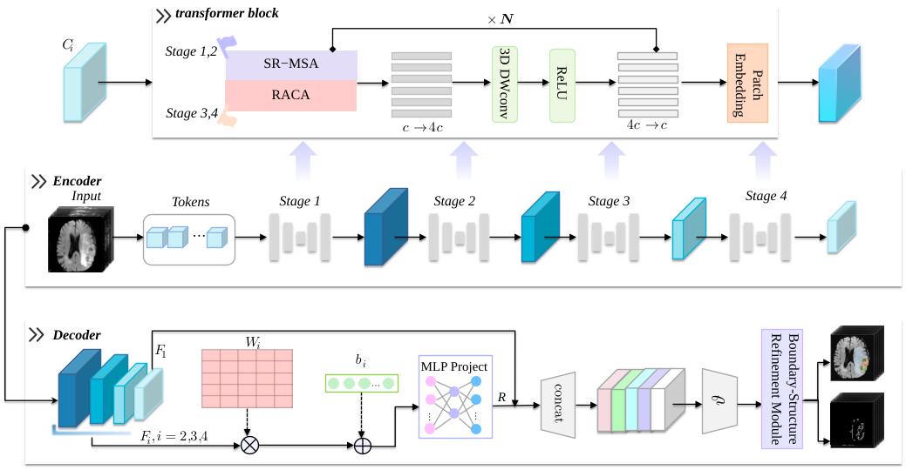

# SREFormer

[](#citation)
[](LICENSE)

This is the official reproducibility repository for **"SREFormer: Selective Representation Enhancement for Lightweight 3D Medical Image Segmentation"**.

## Overall Framework

<p align="center">
  
</p>

<details>
<summary>Abstract</summary>

Three-dimensional medical image segmentation is a fundamental task in computer-aided diagnosis and treatment planning. In recent years, Transformers have been widely adopted for 3D medical image segmentation because of their ability to model long-range dependencies. However, global feature interaction on high-resolution volumetric data usually incurs substantial computational and memory costs, while excessive architectural compression may compromise deep semantic modeling and fine-grained spatial recovery. To address these challenges, we propose a novel lightweight 3D image segmentation network, termed SREFormer, which maintains low computational overhead while enhancing deep semantic interaction and fine-grained spatial structure restoration. Specifically, in the deep encoding stage, we introduce Register-Augmented Context Attention (RACA) to strengthen global semantic interactions across regions. RACA aggregates and broadcasts global context using a small number of Agent Tokens, while incorporating learnable Register Tokens to enrich the representation space of compressed interactions. This design improves deep semantic modeling with only limited additional overhead. In the decoding stage, we further propose a Boundary-Structure Refinement Module (BSRM), which extracts structural information through dual semantic-boundary pathways and refines primary semantic features using boundary responses. As a result, boundary information is directly involved in the final update of segmentation features. We conduct systematic evaluations on three public 3D medical image segmentation datasets: BraTS2017, ACDC, and Synapse. The experimental results demonstrate that SREFormer achieves competitive performance, with average Dice scores of 84.10%, 92.83%, and 80.50% on the three datasets, respectively. It surpasses 18 current state-of-the-art methods, including Swin-Unet, UNETR, and TransUNet. Moreover, SREFormer contains only approximately 4.43M parameters and requires about 13.51 GFLOPs per input volume.

</details>

## News ✨

- **2026-10-07:** The project is quickly updated👋
- **2026-10-07:** We release the Codebase of SREFormer

## Table of Contents

- [Installation](#installation)
- [Dataset Preparation](#dataset-preparation)
- [Usage](#usage)
  - [Training](#training)
  - [Trained Weights](#trained-weights)
- [Results](#results)
- [Citation](#citation)

## Installation

SREFormer is developed based on `python==3.10.19`, `torch==2.11.0`, and `cuda==12.8`.

Clone the repository:

```bash
git clone https://github.com/ShuoMaLab/SREFormer.git
cd SREFormer
```

Create a conda environment (recommended):

```bash
conda create -n SREFormer python=3.10.19 -y
conda activate SREFormer
```

Install the package:

```bash
pip install torch==2.11.0 torchvision==0.26.0 --index-url https://download.pytorch.org/whl/cu128
pip install -e .
```

## Dataset Preparation

The experiments are organized around three public 3D medical segmentation datasets.

| Dataset | Task | Classes |
| --- | --- | --- |
| **BraTS2017** | Brain tumor segmentation | WT, TC, ET |
| **ACDC** | Cardiac MRI segmentation | RV, MYO, LV |
| **Synapse** | Multi-organ abdominal CT segmentation | Aorta, liver, left kidney, right kidney, gallbladder, pancreas, spleen, stomach |

We provide the details about dataset notes in [datasets/README.md](datasets/README.md).

## Usage

### Training

```bash
cd SREFormer
python -m accelerate.commands.launch --config_file ./gpu_accelerate.yaml ./run_experiment.py --config ./experiments/brats_2017/exp_agent_stage34_register_bs2/config.yaml
```

Replace the dataset path in the configuration file with your actual BraTS2017 dataset path.

### Trained Weights

You can download the trained weights on Synapse dataset from [Google Drive](https://drive.google.com/drive/folders/1kk7kzhtD5HtuDSR1qx1-9zq4JjymwqYB?usp=drive_link).

## Results

| Dataset | Dice | HD95 | Params | GFLOPs |
| --- | ---: | ---: | ---: | ---: |
| BraTS2017 | 84.10 | 5.50 | 4.43M | 13.51 |
| ACDC | 92.83 | - | 4.43M | 13.51 |
| Synapse | 80.85 | 9.25 | 5.12M | 13.51 |

Full comparison and ablation tables are provided in [results/reported_results.md](results/reported_results.md).

## Citation

If you find this repository useful, please cite our paper after publication:

```bibtex
@article{sreformer2026,
  title   = {SREFormer: Selective Representation Enhancement for Lightweight 3D Medical Image Segmentation},
  author  = {Author One and Author Two and Author Three},
  journal = {Computerized Medical Imaging and Graphics},
  year    = {2026},
  note    = {Under review}
}
```

## Acknowledgements

The BraTS2017 code organization is based on the SegFormer3D training style. Additional acknowledgements will be updated with the finalized release.

## License

This project is released under the [MIT License](LICENSE).
